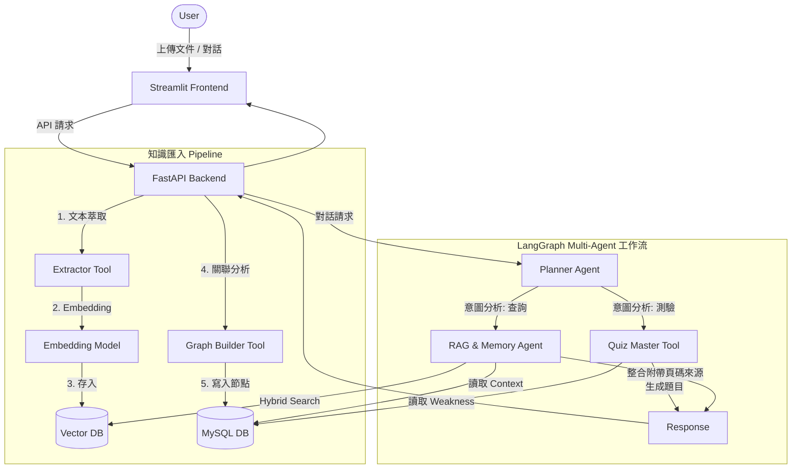

# 系統架構文件 (Architecture) - AI 個人知識管理 Agent

## 1. 核心技術選型
- **後端與 API 框架**：FastAPI (Python)
- **前端 / 原型展示**：Streamlit
- **LLM 與 Agent 框架**：LangChain / LangGraph (用於建構 Planner 與 RAG Agent 的工作流)
- **關聯式資料庫 (RDBMS)**：MySQL (儲存使用者資料、對話紀錄、長期記憶、文件 Metadata)
- **向量資料庫 (Vector DB)**：ChromaDB / Qdrant / Pinecone (三選一，用於儲存知識 Chunk 的 Embedding)
- **AI 模型**：OpenAI API (GPT-4o) 或 Anthropic Claude，負責生成與邏輯推理。
- **Embedding 模型**：OpenAI `text-embedding-3-small` 或開源 BGE 模型。

## 2. 資料庫綱要設計 (Data Schema)

### 2.1 MySQL (Relational DB)
用於儲存結構化、具關聯性的歷史與狀態資料。

1. **Users (使用者表)**
   - `id`: INT, PK
   - `username`: VARCHAR(50)
   - `created_at`: TIMESTAMP

2. **Documents (文件元資料表)**
   - `id`: INT, PK
   - `user_id`: INT, FK
   - `filename`: VARCHAR(255)
   - `file_type`: VARCHAR(10) (e.g., 'pdf', 'md')
   - `summary`: TEXT
   - `created_at`: TIMESTAMP

3. **Conversations (短期記憶 / 對話紀錄表)**
   - `id`: INT, PK
   - `user_id`: INT, FK
   - `role`: VARCHAR(10) ('user', 'assistant', 'system')
   - `content`: TEXT
   - `created_at`: TIMESTAMP

4. **WeaknessMemory (長期記憶 / 弱點追蹤表)**
   - `id`: INT, PK
   - `user_id`: INT, FK
   - `topic`: VARCHAR(100) (知識點主題)
   - `error_count`: INT (錯誤次數，用於決定複習優先級)
   - `last_tested_at`: TIMESTAMP

5. **KnowledgeGraph (知識關聯邊界表)**
   - `id`: INT, PK
   - `source_node_id`: VARCHAR(100)
   - `target_node_id`: VARCHAR(100)
   - `relation_type`: VARCHAR(50)
   - `weight`: FLOAT

### 2.2 Vector DB (向量資料庫)
用於混合檢索 (Hybrid Search) 的文本分塊。

- **Collection: `knowledge_chunks`**
  - `id`: UUID (Chunk 唯一標識)
  - `vector`: Float[] (Embedding 向量)
  - `payload / metadata`:
    - `document_id`: INT (對應 MySQL Documents.id)
    - `page_number`: INT (來源頁碼，用於 Source Attribution)
    - `text`: TEXT (原始文本片段)
    - `tags`: List[String] (關聯標籤)

## 3. 系統架構與多 Agent 協作圖 (System Architecture)



## 4. 核心代碼骨架 (Skeleton Code)

以下展示基於 LangGraph 與 LangChain 的多 Agent 協作骨架：

```python
from typing import TypedDict, Annotated, Sequence
from langchain_core.messages import BaseMessage, HumanMessage
from langgraph.graph import StateGraph, END

# 1. 定義 State
class AgentState(TypedDict):
    messages: Sequence[BaseMessage]
    intent: str
    context: str
    quiz_data: dict

# 2. 定義 Tools (Tool Calling)
def extractor_tool(text: str) -> dict:
    """萃取摘要與標籤"""
    pass

def graph_builder_tool(new_knowledge: str) -> dict:
    """計算關聯性並輸出 Nodes/Edges"""
    pass

def quiz_master_tool(user_id: str) -> dict:
    """根據 MySQL 中的長期記憶 (弱點) 產生測驗"""
    pass

# 3. 定義 Agent 節點邏輯
def planner_node(state: AgentState):
    """分析使用者意圖，決定走 RAG 還是 Quiz"""
    last_message = state["messages"][-1].content
    # (偽代碼) 呼叫 LLM 判斷意圖
    intent = "RAG" if "解釋" in last_message or "什麼" in last_message else "QUIZ"
    return {"intent": intent}

def rag_agent_node(state: AgentState):
    """執行 Hybrid Search 並附帶 Source Attribution"""
    query = state["messages"][-1].content
    # (偽代碼) 進行 Vector DB 與 Keyword 檢索
    # retrieved_docs = vector_db.hybrid_search(query)
    # response = llm.generate_with_sources(retrieved_docs)
    response_msg = "這是一段解答。[來源：AI_Paper.pdf, 頁碼: 4]"
    return {"messages": [response_msg]}

def quiz_agent_node(state: AgentState):
    """調用 Quiz Master 生成題目"""
    # 調用 quiz_master_tool()
    quiz = {"question": "什麼是 Attention?", "options": ["A", "B", "C"]}
    return {"quiz_data": quiz, "messages": ["為您準備了以下測驗：..."]}

# 4. 定義路由條件
def route_intent(state: AgentState):
    if state["intent"] == "RAG":
        return "rag_agent"
    elif state["intent"] == "QUIZ":
        return "quiz_agent"
    return END

# 5. 建立 LangGraph 工作流
workflow = StateGraph(AgentState)

workflow.add_node("planner", planner_node)
workflow.add_node("rag_agent", rag_agent_node)
workflow.add_node("quiz_agent", quiz_agent_node)

workflow.set_entry_point("planner")
workflow.add_conditional_edges("planner", route_intent)
workflow.add_edge("rag_agent", END)
workflow.add_edge("quiz_agent", END)

# 編譯應用
app = workflow.compile()
```
